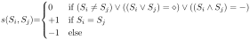
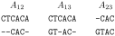

Albert-Ludwigs-Universität Freiburg

Lehrstuhl für Bioinformatik - Institut für Informatik - *http://www.bioinf.uni-freiburg.de*

---
## Bioinformatics 1
###### WS 2021/2022
##### Exercise sheet 9: Multiple Sequence Alignment
---

### _Exercise 1 - Multiple Sequence Alignment_

Multiple alignments (MSA) are a key starting point for the prediction of protein secondary structure, residue accessibility and function, and the identification of residues important for specificity.

One of the challenges in multiple sequence alignment is the choice of the adequate scoring matrix. In the case of protein sequences, the scoring matrices reflect the physicochemical properties of amino acid residues, as well as the likelihood of certain residues being substituted among true homologous sequences. In this exercise we are going to analyze the effects of using two different scoring matrices on the alignments.

Note: if you are using Windows, you can follow [this tutorial](https://mafft.cbrc.jp/alignment/software/windows_cygwin.html) in order to run the analysis in Cywig, a tool that provides a UNIX/Linux-like shell emulated over Windows. As alternative, you can create a [bootable Linux USB drive](https://www.lifewire.com/try-lubuntu-16-04-windows-10-4037886).
    
First, you need to clone/download the assignment:

```
$ git clone git@github.com:Bioinformatics-teaching/lecture-09-aling-msa-userID.git
$ cd lecture-09-aling-msa-userID.git
```

Do not forget to use your own user ID. Now, we'll install [conda](https://docs.conda.io/projects/conda/en/latest/index.html), an open source package and environment management system.

```
$ curl -O https://repo.anaconda.com/miniconda/Miniconda3-latest-Linux-x86_64.sh
$ bash Miniconda3-latest-Linux-x86_64.sh

$ conda config --add channels defaults
$ conda config --add channels bioconda
$ conda config --add channels conda-forge    
```

Next,  we'll create an environment (a directory that contains a specific collection of packages), and will install the requited package.

```    
$ conda create -n alignments
$ conda activate alignmens            
$ conda install mafft
```

Finally, let's compute compute the pairwise alignments of all sequences with the Needleman-Wunsch algorithm by using the BLOSUM30 and BLOSUM80 matrices:

```
$ mafft --bl 30 --globalpair --clustalout sequences/sars_cov2.fasta > alignment_blosum30.maf
$ mafft --bl 80 --globalpair --clustalout sequences/sars_cov2.fasta > alignment_blosum80.maf    
```

**a)** What is the most similar sequence to the omicron variant when using the BLOSUM30 matrix?

- [ ] A. Beta
- [ ] B. Delta
- [ ] C. Gamma

**b)** And when using the BLOSUM80 matrix?

- [ ] A. Beta
- [ ] B. Delta
- [ ] C. Gamma
     
**c)** Which result do you think is more acceptable, taking in account that the percentage of identity is over 95%?

- [ ] A. The results obtained when using the BLOSUM80 matrix is more significant, since this matrix is more suitable for sequences that have more evolutionary distance between them.
- [ ] B. The results obtained when using the BLOSUM30 matrix is more significant, since this matrix is more suitable for sequences that have less evolutionary distance between them.
- [ ] C. The results obtained when using the BLOSUM80 matrix is more significant, since this matrix is more suitable for sequences that have less evolutionary distance between them.

Finally, you can remove conda if you consider that you won't need it any more.

```    
rm -rf ~/miniconda3
```

### _Exercise 2 - Progressive Alignment by Feng and Doolittle_

Given the sequences S<sub>1</sub> = CTCACA, S<sub>2</sub> = CAC, S<sub>3</sub> = GTAC and the following scoring function:

<p align="center">
  
</p>

We want to do progressive alignment following Feng and Doolittle. The needed pairwise alignments are calculated using the Needleman-Wunsch and are as follows:

<p align="center">
  
</p>

The following guide trees are given in [Newick format](https://en.wikipedia.org/wiki/Newick_format).

**a)** Given the guide tree ((S<sub>1</sub>, S<sub>3</sub>), S<sub>2</sub>), what are the possible resulting multiple sequence alignments?

Use the Needleman-Wunsch implementation of the [Freiburg RNA tools webserver (Teaching)](http://rna.informatik.uni-freiburg.de/) to recompute the pairwise alignments.

In case the webserver is not available, you can find the resulting here:

<details>
  <summary>Spoiler: (Click to open)</summary>
    <p align="center">
    
    </p>
</details>

Additionally, calculate the sum-of-pairs scores for each of the computed alignments, when replacing all placeholders ('X') with gaps.

**b)** What are the alignments and sum-of-pairs scores for the guide tree ((S<sub>2</sub>, S<sub>3</sub>), S<sub>1</sub>)?

<details>
  <summary>Spoiler: (Click to open)</summary>
    <p align="center">
    
    </p>
</details>

### _Exercise 3: Scoring Matrices_

Scoring matrices reflect the fact that amino acids with similar physicochemical properties can be more easily substituted than those without similar characteristics, since they are more likely to cause disruptions to the structure and function. This type of disruptive substitution is less likely to be selected in evolution because it renders nonfunctional proteins. 

**a)** PAM matrices
    
- [ ] A. The increasing PAM numbers correlate with increasing PAM units and thus evolutionary distances of protein sequences. For example, PAM250, which corresponds to 20% amino acid identity, represents 250 mutations per 100 residues. In theory, the number of evolutionary changes approximately corresponds to an expected evolutionary span of 2,500 million years. Thus, the PAM250 matrix is normally used for divergent sequences.

- [ ] B. The increasing PAM numbers correlate with increasing PAM units and thus evolutionary distances of protein sequences. For example, PAM250, which corresponds to 20% amino acid identity, represents 250 mutations per 100 residues. In theory, the number of evolutionary changes approximately corresponds to an expected evolutionary span of 2,500 million years. Thus, the PAM250 matrix is normally used for divergent sequences.

- [ ] C. The increasing PAM numbers correlate with increasing PAM units and thus evolutionary distances of protein sequences. For example, PAM250, which corresponds to 20% amino acid identity, represents 250 mutations per 100 residues. In theory, the number of evolutionary changes approximately corresponds to an expected evolutionary span of 2,500 million years. Thus, the PAM250 matrix is normally used for divergent sequences.
    

**b)** BLOSUM matrices

- [ ] A. BLOSUM matrices are derived based on direct observation for every possible amino acid substitution in multiple sequence alignments. The BLOSUM matrices use the extrapolation function instead of the actual percentage identity values of sequences selected for construction of the matrices. For example, BLOSUM62 indicates that the sequences selected for constructing the matrix share an average identity value of 62%. 

- [ ] B. BLOSUM matrices are derived based on direct observation for every possible amino acid substitution in multiple sequence alignments. Instead of using the extrapolation function, the BLOSUM matrices are actual percentage identity values of sequences selected for construction of the matrices. For example, BLOSUM62 indicates that the sequences selected for constructing the matrix share an average divergency value of 62%. 

- [ ] C. BLOSUM matrices are derived based on direct observation for every possible amino acid substitution in multiple sequence alignments. Instead of using the extrapolation function, the BLOSUM matrices are actual percentage identity values of sequences selected for construction of the matrices. For example, BLOSUM62 indicates that the sequences selected for constructing the matrix share an average identity value of 62%. 

    
**c)** Comparison between PAM and BLOSUM

- [ ] A. The principal difference is that the PAM matrices, except PAM1, are derived from an evolutionary model whereas the BLOSUM matrices consist of entirely direct observations. Thus, the BLOSUM matrices may have less evolutionary meaning than the PAM matrices. This is why the PAM matrices are used most often for reconstructing phylogenetic trees. However, because of the mathematical extrapolation procedure used, the PAM values may be less realistic for divergent sequences.

- [ ] B. The principal difference is that the PAM matrices, except PAM1, are derived from an evolutionary model whereas the BLOSUM matrices consist of entirely direct observations. Thus, the BLOSUM matrices may have more evolutionary meaning than the PAM matrices. This is why the BLOSUM matrices are used most often for reconstructing phylogenetic trees. However, because of the mathematical extrapolation procedure used, the BLOSUM values may be less realistic for divergent sequences.

- [ ] C. The principal difference is that the BLOSUM matrices, are derived from an evolutionary model whereas the PAM matrices consist of entirely direct observations. Thus, the BLOSUM matrices may have less evolutionary meaning than the PAM matrices. This is why the PAM matrices are used most often for reconstructing phylogenetic trees. However, because of the mathematical extrapolation procedure used, the PAM values may be less realistic for divergent sequences.


### _Exercise 4 - Programming assignment:_

